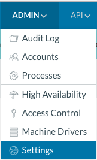
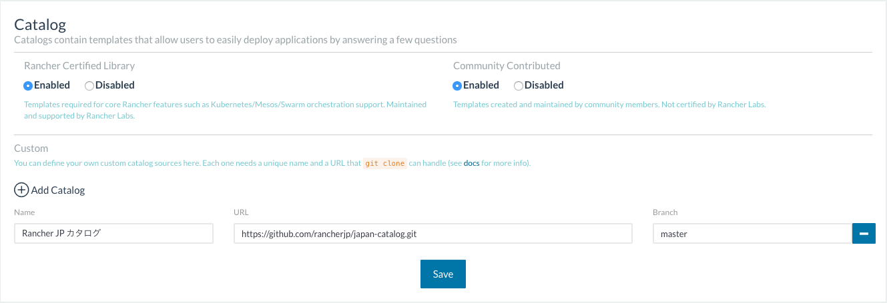

# Rancher JP Community Catalog
This catalog provides templates created by Japan local community, and they are not maintained or supported by Rancher Labs.

## How to use
  
1. Goto "Admin" → "Settings"  

2. Click "Add Catalog"
3. Enter "https://github.com/rancherjp/japan-catalog.git" in URL field and specify "master" in Branch field
4. Click "Save"  

